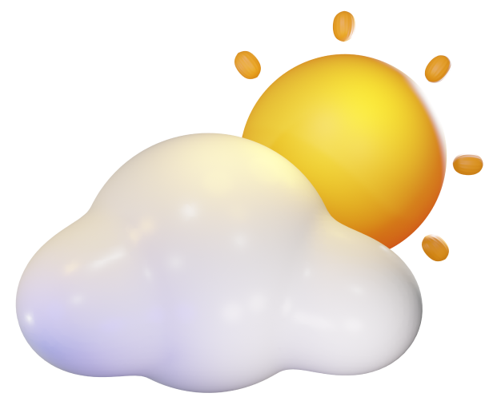

<!-- PROJECT LOGO -->
 

  

  <h3 align="center">Weather App</h3>

  

    Die Webseite, welche Ihnen das Wetter anzeigt
     
    <a href="https://weatherforecast-oltian-flynn.netlify.app/">Live Demo</a>
  

## Mein Projektpartner

[Flynn Guerra](https://github.com/woqqq)

# Informieren

## Projekt

Unser Projekt ist eine Wetter-Applikation in Form einer Webseite. Unsere Daten werden von einer Online-API gelesen und man kann zwischen verschiedenen Städten hin und her wechseln. Dieses Projekt befindet sich momentan in der R-Phase und Sie können den aktuellen Stand unseres Projektes jederzeit mitverfolgen.

## Quellen

## Anforderungen

|     Nummer    |     Muss / Kann?    |     Funktional? Qualität? Rand?    |     Beschreibung                                                                                        |
|:-------------------:|:-------------------------:|:----------------------------------------:|:-------------------------------------------------------------------------------------------------------------:|
|     1             |     muss                |     Funktional                         |     Temperaturen   von verschiedenen Städten je nach Auswahl anzeigen                                       |
|     2             |          muss           |     Funktional                         |     Wetter   Vorhersagen der nächsten 3 Tage anzeigen                                                       |
|     3             |     muss                |     Funktional                         |     Luftfeuchtigkeit,   Windgeschwindigkeit und Luftdruck ebenfalls mit der Temperatur anzeigen   lassen    |
|     4             |     muss                |     Funktional                         |     Minimale und   Maximale Temperatur anzeigen, welche jeweils an diesem Tag erreicht werden kann          |
|     5             |     muss                |     Funktional                         |     Webseite ist   Responsive entwickelt                                                                    |
|     6             |     muss                |     Qualität                           |     Hintergrundbild   und verwendete Icons in entsprechender Qualität (1080p, HD)                           |
|     7             |     muss                |     Qualität                           |     Verwendete   Daten entsprechen dem aktuellen Stand durch die Verwendung einer API                       |
|     8             |     muss                |     Rand                               |     Projekt muss   bis zu dem 29.09.2022                                                                    |
|     9             |     muss                |     Rand                               |     Es müssen mindestens   die Wetterbedingungen von 3 Städten verfügbar sein                               |
#  Planen

|     **Nummer**    |        **Frist**    |                                     **Beschreibung**                                    |     **Zeit (geplant)** |     **Zeit (effektiv)**    |
|:-------------:|:-----------------:|:-----------------------------------------------------------------------------------:|:------------------:|:----------------------:|
|       1.1     |     11.08.2022    |      Über unser   ausgewähltes Projekt informieren und uns für eines Entscheiden    |          60        |            80          |
|       1.2     |     11.08.2022    |                      Projekt   einplanen und Zeitplan erstellen                     |          90        |           120          |
|       1.3     |     11.08.2022    |                           Fällige   Entscheidungen treffen                          |          20        |            25          |
|       2.1     |     18.08.2022    |          Beginn der   Realisierung der Wetter-APP, Design erstellen in FIGMA        |         120        |           120          |
|       2.2     |     18.08.2022    |                           Design in   HTML implementieren                           |         105        |           105          |
|       3.1     |     25.08.2022    |                        Design in   HTML fertig implementieren                       |          40        |            40          |
|       3.2     |     25.08.2022    |                     Bilder   grösse Anpassen für Webseite mit CSS                   |          45        |            30          |
|       4.1     |     25.08.2022    |                   Bootstrap   Cards designen und einen Gap schaffen                 |          45        |            75          |
|       4.2     |     25.08.2022    |                Search bar   und search Buttons entsprechend gestalten               |          45        |            15          |
|       4.3     |     25.08.2022    |                      Grundlegende   webseitüberarbeitung mit CSS                    |          45        |            45          |
|       4.4     |     25.08.2022    |         Versuch   animierten background mit gradient einzubauen // Fehlschlag       |          45        |            45          |
|       4.5     |     01.09.2022    |               CSS-Website designen   und optimaler Weise fertig stellen             |          45        |            45          |
|       5.1     |     08.09.2022    |                Nach   verfügbaren API’s suchen und passende auswählen               |          45        |            45          |
|       5.2     |     08.09.2022    |         Implementationsweisen   recherchieren und beginnen zu implementieren        |          45        |            45          |
|       5.3     |     08.09.2022    |                       API calls   für temperatur implementieren                     |          45        |            45          |
|       5.4     |     08.09.2022    |               API calls   für Luftfeuchtigkeit und Wind Geschwindigkeit             |          45        |            45          |
|       5.5     |     08.09.2022    |                                 Luftdruck   API call                                |          45        |            45          |
|       6.1     |     15.09.2022    |                   Temperatur   placeholder mit API werten ersetzen                  |          45        |            45          |
|       6.2     |     15.09.2022    |     Luftdruck,   Luftfeuchtigkeit und wind Geschwindigkeit Place holder ersetzen    |          45        |            45          |
|       6.3     |     15.09.2022    |                 Icons je   nach Tageszeit und Wetter anpassen beginn                |          45        |            45          |
|       6.4     |     15.09.2022    |                 Icons je   nach Tageszeit und Wetter anpassen beginn                |          45        |            45          |
|       6.5     |     15.09.2022    |                 Icons je   nach Tageszeit und Wetter anpassen beginn                |          45        |            45          |
|       7.1     |     22.09.2022    |                       Feinschliffe   am Programm tätigen / HTML                     |          45        |            45          |
|       7.2     |     22.09.2022    |                       Feinschliffe   am Programm tätigen / CSS                      |          45        |            45          |
|       7.3     |     22.09.2022    |                        Feinschliffe   am Programm tätigen / JS                      |          45        |            45          |
|       7.4     |     22.09.2022    |                        Webseite   debuggen und fehler beheben                       |          45        |            90          |
|       7.5     |     22.09.2022    |                             Projekdokumentation   beenden                           |          45        |            -           |
|       8.1     |     29.09.2022    |                 Projektdokumentation   überarbeiten und jetzt beenden               |          45        |            45          |
|       8.2     |     29.09.2022    |               Projekt   aufnehmen und Medien für Portfolio vorbereiten              |          45        |            45          |
|       8.3     |     29.09.2022    |                      Aufgabenstellung   und Produkt beschreiben                     |          45        |            45          |
|       8.4     |     29.09.2022    |                       Reflexion   mit Teammitglied überarbeiten                     |          45        |            45          |
|       8.5     |     29.09.2022    |                       Portfolio   für die Abgabe bereit machen                      |          45        |            45          |

#  Entscheiden

### Welches Projekt wollen wir realisieren?   
Wir waren uns zu beginn noch nicht sicher mit was für einem Projekt wir beginnen wollen und wir mussten zwischen einem Webshop und einem eigenen Projekt abwägen. Da viele andere Gruppen auch einen Webshop kreieren, haben wir uns für ein eigenes Projekt entschieden und sind schlussendlich auf eine Wetterapp gestossen.

### Design und verwendete Informationen: 
Herr Guerra und ich waren uns nicht ganz einig bei der Menge an verwendeten Daten, die wir eingeplant haben. Wir haben uns dann auf einen Kompromiss geeinigt, welche unser Bedürfnis erfüllt und eine mittelmässige Menge an Daten hat.

### Welche API verwenden wir?
Nach ausführlicher Recherche sind wir auf multiple API für das Wetter gestossen, haben uns jedoch für https://openweathermap.org/forecast5 entschieden, da man in dieser die Vorhersage für die kommenden Tage ansehen kann und es somit perfekt für unsere Applikation passte. Grosse Differenzen in unserer Meinung gab es nicht und wir waren uns hier auch ziemlich einig.

#  Realisieren
Das Projekt befindet sich oben im Ordner.

#  Kontrollieren

## Testfälle

|     Nummer    |                                                   Voraussetzung                                                  |                                                                         Eingabe                                                                        |                                                            Erwartete Ausgabe                                                          |
|:-------------:|:----------------------------------------------------------------------------------------------------------------:|:------------------------------------------------------------------------------------------------------------------------------------------------------:|:-------------------------------------------------------------------------------------------------------------------------------------:|
|       1.1     |                                               Webseite ist geöffnet                                              |                                   Benutzer gibt im Suchfeld «Untersiggenthal» ein und klickt auf den   Button «Suchen»                                 |       Die Temperaturen in 3-Stunden-Pakete werden angezeigt. Somit sieht man   4-Kärtchen mit einem Datum und Uhrzeit beschriftet     |
|       2.1     |                                               Webseite ist geöffnet                                              |                                       Benutzer gibt im Suchfeld «New York» ein und klickt auf den Button «Suchen»                                      |                                    Das Wetter für die nächsten drei Tage von New York wird angezeigt                                  |
|       3.1     |                                               Webseite ist geöffnet                                              |                                       Benutzer gibt im Suchfeld «New York» ein und klickt auf den Button «Suchen»                                      |            Windgeschwindigkeit (in m/s), Luftfeuchtigkeit (in %) und Luftdruck (in   hPa) des heutigen Tages wird angezeigt           |
|       4.1     |        Webseite ist geöffnet und der Benutzer hat bereits «Baden, CH» eingegeben   und eine Suche gestartet      |                                                                    Webseite einsehen                                                                   |                       Die tiefste und höchste Temperatur von dieser Uhrzeit des jeweiligen   Tages wird angezeigt                     |
|       5.1     |                                        Webseite ist auf dem Laptop geöffnet                                      |                      Benutzer öffnet die DevTools vom Browser und schaut sich die   verschiedenen Ansichten an und testet diese aus                    |                         Webseite wird angenehm angepasst, sodass der Inhalt auf jeder   Device-Grösse einsehbar                       |
|       6.1     |     Webseite ist geöffnet und der Benutzer hat bereits «Kleindöttingen» eingegeben   und eine Suche gestartet    |                                      Der Benutzer zoomt in den Bildern in und schaut, ob diese noch scharf bleiben                                     |                                     Die Bilder bleiben scharf und besitzen somit eine gute Qualität                                   |
|       7.1     |        Webseite ist geöffnet und der Benutzer hat bereits «New York» eingegeben   und eine Suche gestartet       |       Der Benutzer öffnet seinen Browser und sucht nach dem aktuellen Wetter   in New York und vergleicht die Werte mit denen auf unserer Webseite     |     Die Werte sind sehr ähnlich und somit ist der API-Call sehr wahrscheinlich   richtig und man kann sich auf diese API verlassen    |
|       9.1     |                                               Webseite ist geöffnet                                              |     Benutzer gibt im Suchfeld «New York» ein und klickt auf den Button «Suchen».   Nach der erfolgreichen Suche gibt er noch drei weitere Orte ein.    |                        Es sind alle Orte verfügbar, da diese API sehr gross ist und sehr   viele Daten anbietet.                      |

## Testprotokoll

|     Nummer    |        Datum      |     Resultat    |      Durchgeführt    |
|:-------------:|:-----------------:|:---------------:|:--------------------:|
|     1.1.1     |     29.09.2022    |        OK       |      Flynn Guerra    |
|      2.1.1    |     29.09.2022    |        NOK      |      Flynn Guerra    |
|      3.1.1    |     29.09.2022    |        OK       |      Flynn Guerra    |
|      4.1.1    |     29.09.2022    |        NOK      |      Flynn Guerra    |
|      5.1.1    |     29.09.2022    |        OK       |      Flynn Guerra    |
|      6.1.1    |     29.09.2022    |        OK       |     Oltian Kadriu    |
|      7.1.1    |     29.09.2022    |        OK       |     Oltian Kadriu    |
|      9.1.1    |     29.09.2022    |        OK       |     Oltian Kadriu    |

### Testbericht
Das Produkt ist so gut wie fertig, die einzigen Fehler, welche bei Testen auftreten sind diejenigen, welche etwas mit mehreren Tagen zu tun haben, da wir die API falsch interpretiert haben, weil wir uns in diesem Bereich noch nicht so auskannten. Unsere verwendete API basiert auf jeweils 3-stündigen vorhersagen und jeder Eintrag liegt 3 Stunden voneinander entfernt. Wir haben gedacht das jeder neuer Eintrag ein neuer Tag ist was hier zu Komplikationen geführt hat. Die restlichen Funktionalen Anforderungen werden bedingungslos erfüllt.

#  Auswerten
Die Gruppenarbeit mit Flynn Guerra verlief sehr gut und wir haben in Harmonie und Einklang zusammengearbeitet. Wir haben immer gemeinsam an allen Aufgaben gearbeitet (Pair Programming, somit war jeder mal Driver und Navigator), da wir uns so wundervoll ergänzen und auch helfen können. Dies war für uns die Effizienteste Arbeitsweise. Natürlich wäre einzelne Arbeitsaufteilung auch nicht schlecht, jedoch bleiben wir bei dieser oft Stecken da wir nicht mehr weiterwissen und wenn wir gemeinsam an einer Sache arbeiten, kriegen wir die Probleme in diesem Bereich dann auch schneller gelöst.

# Entwickelt mit

* [![Bootstrap][Bootstrap.com]][Bootstrap-url]

<!-- KONTAKT -->
# Kontakt

Oltian Kadriu - oltian.kadriu@gmx.ch

Project Link: [https://github.com/okadriu/WeatherApp](https://github.com/okadriu/WeatherApp)

(<a href="#readme-top">Nach oben</a>)

<!-- MARKDOWN LINKS & IMAGES -->
[Bootstrap.com]: https://img.shields.io/badge/Bootstrap-563D7C?style=for-the-badge&logo=bootstrap&logoColor=white
[Bootstrap-url]: https://getbootstrap.com
