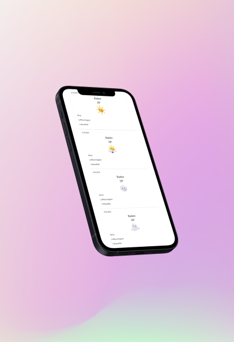

<!-- PROJECT LOGO -->
 

  

  <h3 align="center">Weather App</h3>

  

    Die Webseite, welche Ihnen das Wetter anzeigt
     
    (nur für Bildungszwecke) 
     
     
    <a href="https://github.com/okadriu/WeatherApp">Live Demo</a>
  

<!-- ABOUT THE PROJECT -->
## Über das Projekt

Dieses Projekt ist gerade in der Realisieren-Phase. Sie können jedoch den aktuellen Stand jederzeit sehen.
Im Fach "Lernatelier" realisiere ich diese WeatherApp mit meinem Projektpartner "Flynn Guerra".

Das kann unsere WeatherApp:
* Das aktuelle Wetter für Ihren Ort anzeigen
* Das Wetter für die nächsten drei Tage vorhersagen (jeweils den höchsten und tiefsten Wert an diesen Tagen)
* Der Benutzer kann einen Ort eingeben, und erhält dann eine Ansicht über das aktuelle Wetter an diesem Ort

(<a href="#readme-top">back to top</a>)

## Entwickelt mit

* [![Bootstrap][Bootstrap.com]][Bootstrap-url]
* [![JQuery][JQuery.com]][JQuery-url]

(<a href="#readme-top">back to top</a>)

<!-- PROJEKTDOKUMENTATION -->
## Projektdokumentation

Hier finden Sie unsere <a href="https://github.com/okadriu/WeatherApp">Projektdokumentation</a>

(<a href="#readme-top">back to top</a>)

<!-- CONTACT -->
## Contact

Oltian Kadriu - oltian.kadriu@gmx.ch

Project Link: [https://github.com/okadriu/WeatherApp](https://github.com/okadriu/WeatherApp)

(<a href="#readme-top">back to top</a>)

<!-- ACKNOWLEDGMENTS -->
## Quellen

* [Quelle1](#)
* [Quelle2](#)
* [Quelle3](#)
* [Quelle4](#)

(<a href="#readme-top">back to top</a>)

<!-- MARKDOWN LINKS & IMAGES -->
[Bootstrap.com]: https://img.shields.io/badge/Bootstrap-563D7C?style=for-the-badge&logo=bootstrap&logoColor=white
[Bootstrap-url]: https://getbootstrap.com
[JQuery.com]: https://img.shields.io/badge/jQuery-0769AD?style=for-the-badge&logo=jquery&logoColor=white
[JQuery-url]: https://jquery.com
